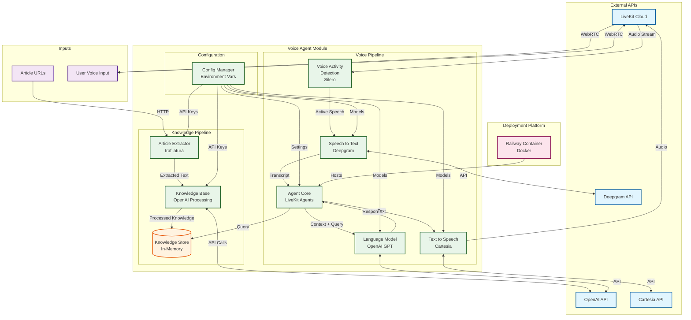
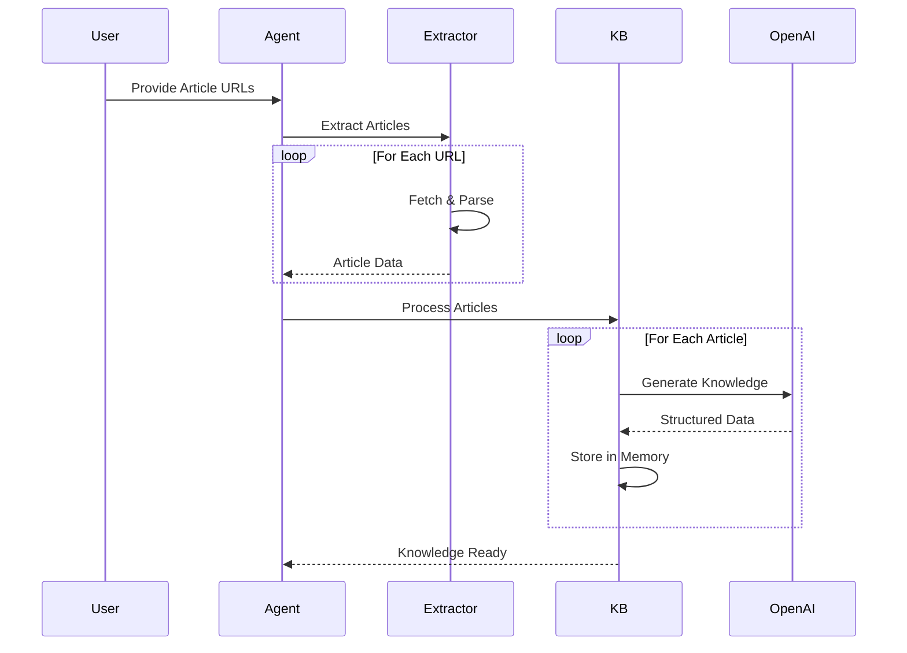
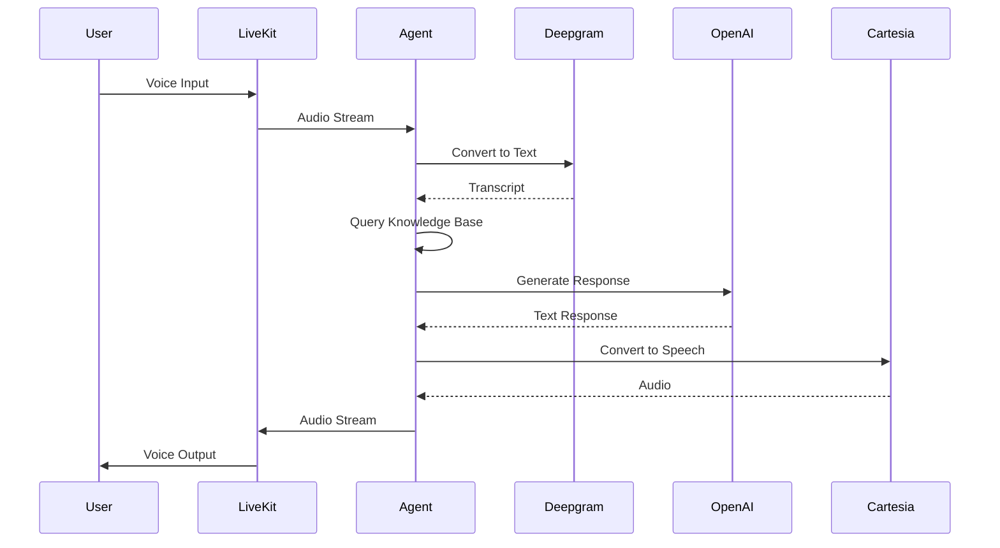
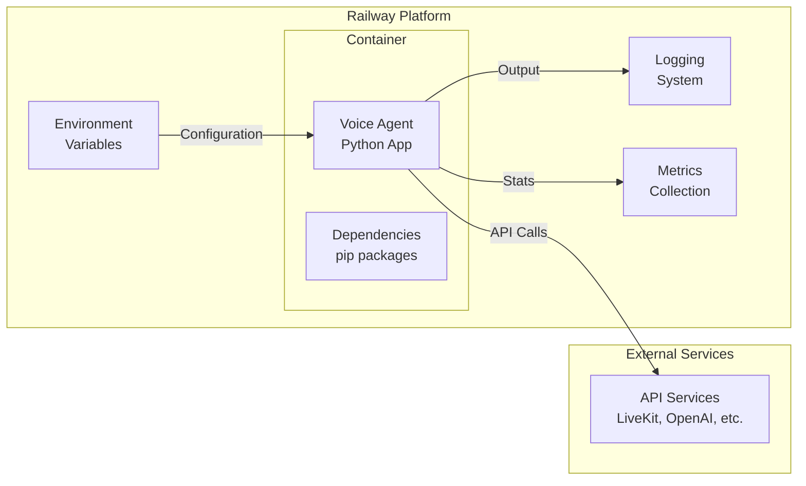

# Voice Agent Architecture 🏗️

This document describes the architecture and data flow of the Voice Agent Module.

## System Overview

The Voice Agent Module is designed as a modular, scalable system that processes article content into a searchable knowledge base and enables real-time voice conversations about that content.

## Architecture Diagram



## Component Details

### 1. Article Extractor (`article_extractor.py`)

**Purpose**: Extract clean, readable text from web articles

**Key Features**:
- Uses trafilatura for robust extraction
- Handles various article formats
- Extracts metadata (title, author, date)
- Cleans and formats text for processing

**Data Flow**:
```
URL → HTTP Request → HTML → Extraction → Clean Text + Metadata
```

### 2. Knowledge Base (`knowledge_base.py`)

**Purpose**: Process raw article text into structured, searchable knowledge

**Key Features**:
- Generates article summaries
- Extracts key points and topics
- Creates conversational context
- Provides search functionality

**Processing Pipeline**:
```
Article Text → OpenAI API → {
    Summary,
    Key Points,
    Topics,
    Context
} → Knowledge Store
```

### 3. Voice Agent (`agent.py`)

**Purpose**: Orchestrate real-time voice conversations using the knowledge base

**Key Features**:
- Manages WebRTC connections via LiveKit
- Coordinates STT/TTS pipeline
- Queries knowledge base
- Generates contextual responses

**Conversation Flow**:
```
1. User speaks
2. VAD detects speech activity
3. STT converts to text
4. Agent processes query
5. LLM generates response
6. TTS converts to speech
7. Audio sent back to user
```

### 4. Configuration (`config.py`)

**Purpose**: Centralized configuration management

**Key Features**:
- Environment variable validation
- API key management
- Model selection
- Logging configuration

## Data Flow Patterns

### Knowledge Preparation Flow



### Voice Conversation Flow



## Deployment Architecture

### Railway Deployment



## Scalability Considerations

### Vertical Scaling
- Increase memory for larger knowledge bases
- More CPU for concurrent conversations
- Adjust based on article complexity

### Horizontal Scaling
- Multiple agent instances
- Load balancing via LiveKit
- Shared knowledge base (future: Redis)

### Performance Optimizations
1. **Knowledge Caching**: Store processed articles
2. **Connection Pooling**: Reuse API connections
3. **Async Processing**: Non-blocking I/O operations
4. **Batch Processing**: Multiple articles at once

## Security Architecture

### API Key Management
```
Environment Variables
    ↓
Config Module (validation)
    ↓
Service Clients (usage)
```

### Data Privacy
- No persistent storage of conversations
- Article content processed in memory
- API keys never logged
- Secure WebRTC connections

## Extension Points

### Adding New STT Providers
```python
# Easy to swap providers
stt=azure.STT(model="whisper")  # Instead of Deepgram
```

### Adding New TTS Providers
```python
# Flexible TTS selection
tts=elevenlabs.TTS(voice_id="custom")  # Instead of Cartesia
```

### Custom Knowledge Processing
```python
# Extend KnowledgeBase class
class CustomKnowledgeBase(KnowledgeBase):
    def process_article(self, article):
        # Custom processing logic
        pass
```

## Monitoring and Observability

### Logging Hierarchy
```
INFO: High-level operations
DEBUG: Detailed processing steps
WARNING: Non-critical issues
ERROR: Failures requiring attention
```

### Key Metrics
- Article extraction success rate
- Knowledge processing time
- STT/TTS latency
- API call counts
- Memory usage

## Future Architecture Enhancements

### Phase 1: Persistence
- Add database for knowledge storage
- Implement article caching
- Session management

### Phase 2: Advanced Features
- Multi-language support
- Real-time article updates
- Voice customization
- Emotion detection

### Phase 3: Scale
- Distributed knowledge base
- Multi-region deployment
- WebSocket clustering
- Advanced caching strategies

---

This architecture provides a solid foundation for a production-ready voice agent system while maintaining flexibility for future enhancements.